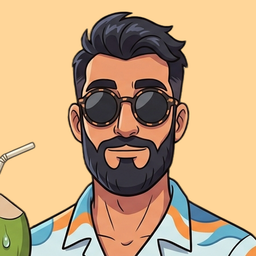
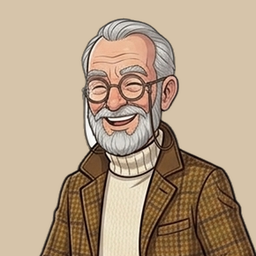
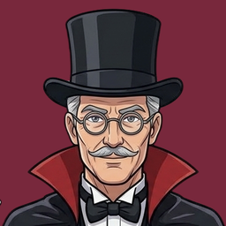
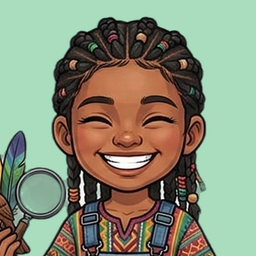
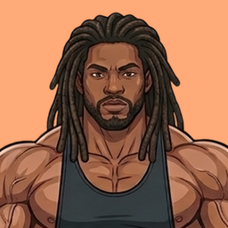
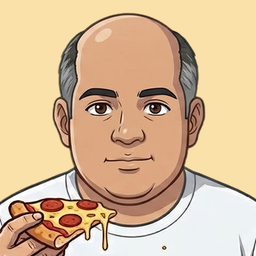
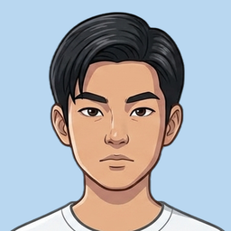
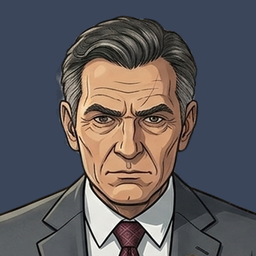

# Personagens: roteiro

Os 9 adversários da Jornada, um por nível do Maia. Fichas em `assets/characters/<id>.json`, avatares em `assets/characters/<id>/avatar.png` (256 px, quadrado, recortados das imagens do Gabriel) e falas em `assets/lines/<idioma>/<id>.json` (inglês e português, os mesmos ids). As falas foram escritas por IA a partir dos estereótipos do Gabriel e passam pelo `tools/check_lines.py` no CI.

Cada fala tem categoria (o evento da partida), intensidade (1 a 3) e emoção. As categorias são do ponto de vista do personagem. A T25 liga isso à partida (avaliação, eventos e escolha da fala); este arquivo é só o roteiro.

| Nível | Personagem | Quem é |
| --- | --- | --- |
| 1000 | **Coco** (`beachgoer`) | Praieiro de boa, joga no ritmo da maré. |
| 1200 | **Tito** (`grandpa`) | Décadas de xadrez de praça e um causo pra cada lance. |
| 1400 | **Percival** (`snob`) | Bronze no Aberto do Bairro e não deixa ninguém esquecer. |
| 1600 | **Valdini** (`magician`) | O mágico que sempre tem um coelho na cartola. |
| 1800 | **Zuri** (`prodigy`) | Pequena exploradora, grandes descobertas no tabuleiro. |
| 2000 | **Tank** (`bodybuilder`) | Xadrez é treino: foco, carga e bora! |
| 2200 | **Gino** (`foodie`) | Come pizza, joga sem pressa e não deixa sobrar nada. |
| 2400 | **Kai** (`youngster`) | O prodígio da blitz online: calmo, frio e sempre calculando. |
| 2600 | **Viktor** (`master`) | O grande mestre que ensina enquanto vence. |

## 1000 · Coco

Coco é um praieiro de óculos escuros, camisa estampada de ondas e sempre com uma água de coco na mão. Joga sem pressa, meio distraído com a gaivota ou com a brisa, e confia que a maré sempre vira. Ganhando, fica todo tranquilo e oferece um coco; perdendo, ri, culpa o sol e chama pra outra rodada. Vive dizendo 'de boa', 'parceiro', 'segura a onda' e fala de tudo com imagens de mar, areia e surfe.

110 falas.

**Começo da partida** (`gameStart`)

- E aí, parceiro! Puxa a cadeira de praia que hoje é de boa.
- Sol na cara, coco na mão e um tabuleiro. Vida boa, hein?
- Bora jogar sem estresse? Quem perder paga a água de coco.
- Relaxa que eu jogo no ritmo da maré: devagar e sempre.
- Segura a onda, que o praieiro chegou pra surfar no tabuleiro!

**Ganhando com folga** (`bigAdvantage`)

- Ih, a maré tá toda a meu favor. Que tranquilidade.
- Isso aqui tá mais fácil que pegar onda de meio metro.
- Pode tirar o guarda-sol, que o meu dia tá ensolarado.
- Tô deitado na rede, só esperando o pôr do sol chegar.
- Mano, tá tão de boa que vou pedir outro coco pra comemorar.

**Um pouco melhor** (`better`)

- Tô sentindo uma brisa boa do meu lado do tabuleiro.
- Opa, parece que a onda tá formando pra mim.
- Devagarinho eu chego lá. Sem pressa, parceiro.
- Tá ficando gostoso, igual areia quentinha no fim da tarde.
- Acho que essa onda eu pego até a beira.

**Posição igual** (`equal`)

- Mar calmo, ninguém na frente. Tá tudo de boa.
- Hmm, deixa eu dar um gole aqui e pensar com calma.
- Tá igualzinho, tipo castelo de areia de dois lados.
- Empatado por enquanto. A maré ainda vai mudar.
- Que jogo gostoso, cara! Ninguém cede um grão de areia.

**Um pouco pior** (`worse`)

- Ih, entrou uma areinha no meu chinelo. Nada demais.
- Opa, de onde veio essa marola?
- Tá batendo um ventinho contra, mas segue o baile.
- Relaxa, coração. Tem muita praia pela frente ainda.
- Acho que esqueci o protetor solar. Tô começando a arder.

**Perdendo** (`bigDisadvantage`)

- É, levei um caldo. Mas o mar é assim mesmo.
- Minha prancha foi embora e eu fiquei boiando aqui.
- Tá feio, mas pelo menos o coco tá geladinho.
- Mano, a maré subiu e levou meu castelo inteiro!
- Tá difícil, parceiro. Mas eu não largo o guarda-sol, não.

**Você errou feio** (`opponentBlunder`)

- Eita, deu mole aí, hein? Tirei o óculos pra ver melhor.
- Calma, parceiro. Acontece com todo mundo, até comigo.
- Opa! Caiu um coco do céu bem na minha mão!
- Tá jogando de olho fechado, igual cochilo na rede?
- Valeu pelo presente! Essa onda veio perfeitinha.

**Ele errou feio** (`ownBlunder`)

- Xi, me distraí olhando a gaivota. Foi mal.
- Ih, vacilei. Mas de boa, segue o jogo.
- Pô, caiu areia no meu coco e no meu lance.
- Esse lance aí foi o sol batendo na cabeça.
- Ah, não! Tomei um caldo daqueles, de engolir água!

**Seu lance muito forte** (`strongMove`)

- Uou! Esse lance aí foi manobra de campeonato.
- Que onda bonita você pegou, parceiro!
- Até tirei o óculos escuro pra ver esse lance.
- Respeito. Esse aí veio que nem tubo perfeito.
- Caramba! Quase deixei o coco cair da mão!

**Ele virou a partida** (`comeback`)

- Viu só? A maré sempre volta.
- Remei, remei e peguei a onda de volta!
- Falei que era só ter paciência. De boa na lagoa.
- É disso que eu tô falando! Virei igual onda quebrando!
- O sol voltou a brilhar do meu lado, parceiro.

**Ele deixou a vitória escapar** (`collapse`)

- Ué, cadê minha vantagem? Deixei na areia?
- Ih, a onda passou e eu fiquei olhando. Faz parte.
- Tava tão de boa que acabei cochilando na rede.
- A maré virou e levou meu chinelo junto.
- Mano, eu tinha tudo! Escorreguei na prancha!

**Ele ganhou uma peça** (`pieceCaptured`)

- Essa aqui eu vou levar pra casa, igual conchinha.
- Opa, peguei! Valeu, parceiro.
- Pegou carona na minha prancha. Bem-vinda!
- Mais uma pro meu balde de areia!
- Essa veio que nem coco caindo do coqueiro!

**Ele perdeu uma peça** (`pieceLost`)

- Ih, levou minha peça. A onda dá, a onda leva.
- Ué, cadê ela? Tava aqui do lado do coco.
- Perdi minha peça igual perco chinelo na praia.
- Tudo bem, ela foi dar um mergulho. De boa.
- Pô, essa doeu mais que pisar em ouriço!

**Ele promoveu** (`ownPromotion`)

- Meu peãozinho chegou na beira. Que viagem!
- Saiu da areia e virou rei da praia. Quer dizer, dama!
- Pegou a onda inteirinha, do fundo até a areia!
- Dama nova na área! Essa merece um coco gelado.
- Aloha, dama! Chegou bronzeada e tudo!

**Você promoveu** (`opponentPromotion`)

- Ih, seu peão atravessou a praia inteira.
- Bela caminhada, hein? Merece um coco.
- Pô, eu tava olhando o mar e ele passou.
- Dama nova do seu lado? Que onda, hein!
- Ah, não! Agora o mar ficou bravo de verdade.

**Seu tempo acabando** (`opponentLowTime`)

- Ó o relógio, parceiro. Sem pressa, mas com pressa.
- Seu tempo tá derretendo igual picolé no sol.
- A maré do seu relógio tá baixando rapidinho.
- Respira, parceiro. Mas respira rápido!
- Corre que o sol tá se pondo no seu relógio!

**O tempo dele acabando** (`ownLowTime`)

- Eita, fiquei curtindo a brisa e o tempo voou.
- Tá pouco tempo, mas pânico não combina com praia.
- Pô, cochilei na rede e o relógio não esperou.
- Beleza, larguei o coco. Agora é sério.
- Socorro, salva-vidas! Meu relógio tá se afogando!

**Ele tem mais tempo (joga no relógio)** (`timeAdvantage`)

- Tenho tempo de sobra. Vou só dar mais um golinho.
- Eu tô na hora da praia, você tá na hora do rush.
- Sem pressa nenhuma. O relógio é que tem pressa por você.
- Vou passar um protetor antes de mexer. Tempo não falta.
- Eu tenho a tarde toda, parceiro. E você?

**Você pensando muito** (`opponentThinking`)

- Pensa com calma. Eu vou ali ver o mar e já volto.
- Deu tempo de eu tomar um coco inteiro, hein.
- Tá esperando a onda perfeita? Às vezes ela não vem.
- De boa, parceiro. Vou só ajeitar o guarda-sol.
- Já tô bronzeado só de esperar seu lance!

**Ele venceu** (`win`)

- Boa partida, parceiro! Bora tomar um coco?
- Ganhei na maciota, sem estresse. Do jeito que eu gosto.
- Peguei a onda até a areia. Aloha!
- Que dia lindo! Sol, coco e vitória.
- Rei da praia, parceiro! Volta amanhã que tem mais.

**Ele perdeu** (`loss`)

- Perdi, mas de boa. O mar continua lindo.
- Mandou bem, parceiro! O coco hoje é por minha conta.
- Levei um caldo, mas amanhã tem onda nova.
- Culpa do sol, que bateu bem na minha cabeça.
- Tomei uma surra, mas quem liga? Bora outra rodada!

**Empate** (`draw`)

- Empate! Ninguém se afogou, todo mundo feliz.
- Meio a meio, igual dividir um coco com dois canudos.
- Castelo de areia empatado. Justo, né?
- Ué, acabou assim? A maré parou no meio!
- Empatou, mas foi um baita dia de praia, parceiro.

## 1200 · Tito

Seu Tito é um vovô bonachão de paletó xadrez, óculos redondos e bengala de cabeça de leão, que joga na praça há décadas. Joga devagar e sem pressa, confiando na experiência mais do que no cálculo. Ganhando, provoca com carinho e promete contar a partida pros amigos; perdendo, culpa os óculos, os joelhos ou o cochilo, e pede revanche. Vive dizendo "no meu tempo...", chama o jogador de "meu jovem" e solta um "ora bolas!" quando erra.

110 falas.

**Começo da partida** (`gameStart`)

- Senta aí, meu jovem. O vovô aqui não morde... muito.
- No meu tempo, a gente jogava na praça até o sol ir embora.
- Deixa eu ajeitar os óculos. Pronto, agora te enxergo!
- Já joguei com gente melhor que você... acho. Faz tempo!
- Esta bengala já viu muita partida. Hoje vê mais uma!

**Ganhando com folga** (`bigAdvantage`)

- Hehe, o vovô ainda tem lenha pra queimar!
- Quer um chazinho, meu jovem? Vai precisar.
- No meu tempo, isso se chamava aula de graça.
- Não fica triste. Até o vovô já perdeu assim. Em 1962.
- Essa aqui eu vou contar pros amigos da praça!

**Um pouco melhor** (`better`)

- Hmm, tá ficando do jeitinho que o vovô gosta.
- Sinto um cheirinho de vitória no ar.
- Devagar e sempre, meu jovem. Assim se ganha final.
- Os joelhos rangem, mas a cabeça tá afiada!
- Tô um passinho na frente. E olha que eu ando de bengala!

**Posição igual** (`equal`)

- Tudo empatadinho. Igual papo de praça: ninguém cede.
- Hmm... deixa o vovô pensar com calma.
- Você é teimoso que nem eu era na sua idade!
- Partida boa assim me lembra os velhos tempos.
- Quem piscar primeiro perde. Sorte que eu pisco devagar.

**Um pouco pior** (`worse`)

- Opa, opa! Onde foi que o vovô se distraiu?
- Calma, que já saí de buraco pior que esse.
- Deixa eu limpar os óculos. Isso não pode estar certo.
- Ah, meu jovem, você tá apertando o velhinho!
- Isso tá mais difícil que subir escada de bengala.

**Perdendo** (`bigDisadvantage`)

- Ai, ai... no meu tempo eu não perdia assim.
- Essa partida tá me dando dor nas costas.
- Vamos dizer que foi o sol nos óculos. Combinado?
- Meu jovem, tenha dó de um velho cansado...
- Ainda não acabou! Já vi milagre na praça, viu?

**Você errou feio** (`opponentBlunder`)

- Opa! Essa até eu, sem óculos, enxerguei.
- Hehe, a pressa é inimiga da perfeição, meu jovem.
- Obrigado pelo presente! Nem é meu aniversário.
- No meu tempo, quem fazia isso pagava o café da turma.
- Ahá! Essa vai pro meu caderninho de causos!

**Ele errou feio** (`ownBlunder`)

- Ih... a mão foi mais rápida que a cabeça.
- Esses óculos tão precisando de grau novo.
- Que bobagem! Finge que não viu, meu jovem?
- Foi de propósito. Pra deixar mais emocionante. Claro.
- Ora bolas! Cinquenta anos de praça e faço uma dessas!

**Seu lance muito forte** (`strongMove`)

- Eita! Esse lance tem cara de gente grande.
- Bonito, meu jovem. Bonito mesmo.
- Esse aí eu queria ter visto primeiro!
- Opa! Quem te ensinou isso? Fala que foi um velhinho.
- Tiro o chapéu! Se eu usasse chapéu, claro.

**Ele virou a partida** (`comeback`)

- Devagarinho o vovô vai chegando lá!
- Achou que o velhinho tava acabado, né?
- Experiência, meu jovem. Não se compra na farmácia.
- Virou! Igualzinho à final da praça de 1974!
- A bengala é pra andar, não pra desistir!

**Ele deixou a vitória escapar** (`collapse`)

- Ué? Cadê a vantagem que tava aqui agorinha?
- Deixei escapar. Igual meus cabelos.
- Isso que dá cochilar no meio da partida!
- Calma, vovô, calma. Respira fundo.
- Ah, não! Tava na mão e escorregou que nem sabonete!

**Ele ganhou uma peça** (`pieceCaptured`)

- Essa eu guardo no bolso do paletó.
- Com licença, meu jovem. Essa é minha.
- Peguei! Ainda tenho mão rápida, viu?
- Hehe, mais uma pra coleção do vovô.
- Tá vendo? Na praça a gente chama isso de almoço!

**Ele perdeu uma peça** (`pieceLost`)

- Ai, essa doeu mais que meu joelho.
- Ué, ela tava aí? Preciso trocar esses óculos.
- Tá bom, tá bom, pode levar. Mas cuida bem dela.
- Lá se vai minha peça. Igual meus tempos de mocidade.
- Ora bolas! Essa peça tava comigo desde o começo!

**Ele promoveu** (`ownPromotion`)

- Meu peãozinho cresceu! Que orgulho do vovô.
- Esse peão andou mais que eu na caminhada da manhã!
- Coroado! Igual eu na festa da praça de 1981.
- Devagar e sempre, chegou lá. Que nem eu!
- Promovido! Esse peão merece até aposentadoria.

**Você promoveu** (`opponentPromotion`)

- Ih, esse peãozinho escapou do vovô.
- Bem jogado. Eu fazia isso na sua idade.
- Ai, ai, peça nova. Não precisava, meu jovem.
- Eu vi ele andando! Achei que ia cansar no caminho.
- Agora sim o vovô tá encrencado!

**Seu tempo acabando** (`opponentLowTime`)

- Olha o relógio, meu jovem. Ele não espera ninguém.
- Tique-taque! Na minha idade a gente ouve isso alto.
- Pressa, meu jovem? Eu tenho a tarde toda.
- O tempo voa, meu jovem. Eu que o diga!
- Seu relógio tá mais apressado que ônibus atrasado!

**O tempo dele acabando** (`ownLowTime`)

- Opa, o relógio tá correndo mais que eu.
- Pouco tempo. Bora, vovô, sem cochilo agora.
- Ai, ai, no meu tempo o relógio era mais devagar!
- Gastei meu tempo contando causo. De novo!
- Rápido, mão! Rápido! Ela não obedece como antes...

**Ele tem mais tempo (joga no relógio)** (`timeAdvantage`)

- Sem pressa. O vovô tem tempo de sobra.
- Vou pensar com calma. Enquanto isso, conto um causo?
- Aposentado tem tempo, meu jovem. Muito tempo.
- Hmm, deixa eu limpar os óculos... bem devagarinho.
- Pode suar, meu jovem. Eu vou no meu ritmo.

**Você pensando muito** (`opponentThinking`)

- Pensa, pensa. Eu espero, já esperei muito na vida.
- Tá pensando ou cochilando? Eu entendo dos dois.
- Vou dar uma volta no quarteirão e já volto.
- No meu tempo a gente pensava assim também. E cochilava.
- Meu jovem, minha barba cresceu enquanto você pensava!

**Ele venceu** (`win`)

- Boa partida, meu jovem. Volta amanhã que tem mais.
- O vovô ainda tá no páreo! Hehe!
- Essa vai virar causo na praça, pode ter certeza.
- Velho, sim. Aposentado do tabuleiro, nunca!
- Ganhei! Vou ligar pros netos contando!

**Ele perdeu** (`loss`)

- Bem jogado, meu jovem. Você mereceu.
- Ai, ai... hoje não foi o dia do vovô.
- Vou dizer pros amigos que eu deixei. Combinado?
- Perdi, mas que partida bonita! Valeu a tarde.
- Revanche! O vovô quer revanche, já!

**Empate** (`draw`)

- Empate honesto. Aperta aqui a mão do vovô.
- Ninguém perdeu! Melhor jeito de terminar a tarde.
- Empate! Igual discussão de futebol na praça.
- Ué, acabou? Eu tava só esquentando!
- Empate? Eu queria era a vitória, meu jovem!

## 1400 · Percival

Percival usa óculos, paletó de tweed e uma medalha no peito: bronze no Aberto do Bairro, que ele cita a cada lance. Joga de braços cruzados e desdenha de tudo o que o adversário faz, mesmo quando o lance é bom. Ganhando, fica insuportável de tão satisfeito e oferece autógrafos. Perdendo, culpa a luz, os óculos, o relógio ou o tabuleiro torto, nunca a si mesmo. Adora dizer que foi de propósito e que você não entenderia.

111 falas.

**Começo da partida** (`gameStart`)

- Boa sorte. Você vai precisar, eu tenho medalha.
- Bronze no Aberto do Bairro. Só pra você saber com quem fala.
- Vou jogar devagar, pra você acompanhar.
- Final? Eu nasci num final. Figurativamente.
- Ajeito os óculos e começamos. Tente não me entediar.

**Ganhando com folga** (`bigAdvantage`)

- Previsível. Igual à final do Aberto do Bairro.
- Isso aqui eu resolvo de braços cruzados. Literalmente.
- Calma, não precisa ficar nervoso. Ainda.
- Quer que eu explique o que deu errado? Cobro pouco.
- Técnica de medalhista. Anota aí.

**Um pouco melhor** (`better`)

- Hm. Exatamente como planejei.
- Vantagem pequena, mas é minha. Como a medalha.
- Agora é só técnica. Coisa que eu tenho de sobra.
- Sente essa pressãozinha? Sou eu.
- Mais uns lances e você vai pedir autógrafo.

**Posição igual** (`equal`)

- Igual? Só no tabuleiro. No talento, não.
- Interessante. Você está me dando algum trabalho.
- Estou só esperando você errar. Paciência de campeão.
- Empatado por enquanto. Estou sendo generoso.
- Por que isso ainda está igual? Eu tenho medalha!

**Um pouco pior** (`worse`)

- Estou te dando corda. Faz parte do plano.
- Hm. Esses óculos estão embaçando.
- Uma pequena concessão estratégica. Você não entenderia.
- Esse paletó de tweed esquenta demais, sabia?
- Estou só... testando uma teoria nova.

**Perdendo** (`bigDisadvantage`)

- Isso nunca aconteceria no Aberto do Bairro.
- A luz daqui está péssima. Ninguém consegue jogar assim.
- Estou jogando com metade da concentração. Por educação.
- Sorte de principiante. É estatística pura.
- Alguém viu minha medalha? Ela me dá sorte.

**Você errou feio** (`opponentBlunder`)

- Ah, que gracinha. Você achou que esse lance funcionava?
- Tsc, tsc. Previsível.
- Isso foi um presente? Vou pendurar do lado da medalha.
- Eu vi isso três lances atrás. Claro que vi.
- Esse lance eu vou contar no clube. Sem dizer seu nome.

**Ele errou feio** (`ownBlunder`)

- Foi de propósito. Para deixar mais emocionante.
- Escorregou a mão. O tweed é escorregadio.
- Isso foi um sacrifício. Muito profundo pra você.
- Quem mexeu nessa peça? Não fui eu.
- Os óculos. Foi culpa dos óculos.

**Seu lance muito forte** (`strongMove`)

- Hm. Até um relógio parado acerta duas vezes por dia.
- Lance razoável. Eu teria jogado igual, só que antes.
- Você leu isso em algum livro, né? Confessa.
- Certo. Vou descruzar os braços agora.
- Bom lance. Para o seu nível, ótimo lance.

**Ele virou a partida** (`comeback`)

- Tudo calculado. Eu só estava te iludindo.
- É assim que se vira um jogo. Foi assim que ganhei a medalha.
- A ordem natural das coisas foi restaurada.
- Gostou da emoção? Eu dei de brinde.
- Viu? Campeão nunca está perdendo. Só esperando.

**Ele deixou a vitória escapar** (`collapse`)

- Isso não conta. Eu estava ajeitando a medalha.
- Espera, espera. Estava ganho. Estava ganho!
- Quis te dar uma chance. Me arrependo.
- Alguém espirrou. Perdi a linha de raciocínio.
- Isso é um erro de digitação do tabuleiro.

**Ele ganhou uma peça** (`pieceCaptured`)

- Obrigado. Vou guardar com carinho.
- Mais uma pra coleção. Ao lado da medalha.
- Você nem viu de onde veio, né?
- Delícia. Quer tentar proteger as outras?
- Essa peça estava pedindo pra sair.

**Ele perdeu uma peça** (`pieceLost`)

- Pode levar. Eu nem gostava dela.
- Peça? Que peça? Eu tenho medalha, não preciso de peça.
- Isso foi um empréstimo. Vou querer de volta.
- Ei! Eu estava ajeitando os óculos!
- Sacrifício posicional. Você vai entender em uns dez anos.

**Ele promoveu** (`ownPromotion`)

- Uma dama nova. Combina com o meu paletó.
- Promoção. Como a que eu mereço no clube.
- Coroado! Agora são duas majestades aqui: ela e eu.
- Peão vira dama. Igual a mim no Aberto do Bairro.
- Técnica de final básica. Pra mim, claro.

**Você promoveu** (`opponentPromotion`)

- Uma dama. Que fofo. Ainda não é medalha.
- Eu deixei aquele peão passar. Por pena.
- Isso... isso não estava no meu plano A. Nem no B.
- Quem deixou esse peão andar tanto?
- Uma dama a mais não assusta um medalhista.

**Seu tempo acabando** (`opponentLowTime`)

- O relógio está correndo. O seu, no caso.
- Tique-taque. Quer que eu pense por você?
- Medalhista administra o tempo. Você, nem tanto.
- Se apressa, eu tenho um jantar de premiação.
- Respira. Ah, não, não dá tempo.

**O tempo dele acabando** (`ownLowTime`)

- Eu jogo melhor sob pressão. Sempre.
- Esse relógio está adiantado. Certeza.
- Rápido, rápido! Digo, com elegância!
- Gastei tempo te analisando. Valeu a pena? Não.
- Pouco tempo, muito talento. Equilibra.

**Ele tem mais tempo (joga no relógio)** (`timeAdvantage`)

- Vou tomar meu tempo. Eu tenho de sobra.
- Deixa eu admirar a posição mais um pouquinho.
- Olha meu relógio. Agora olha o seu.
- Vou polir a medalha enquanto você se apressa.
- Sem pressa. Campeão não corre.

**Você pensando muito** (`opponentThinking`)

- Pensando? Leve o tempo que precisar. Muito tempo.
- Quer uma dica? Não. Eu também não daria.
- Eu já sei o que você vai jogar. E está errado.
- Deu tempo de eu reler meu certificado inteiro.
- Fico aqui, de braços cruzados, esperando.

**Ele venceu** (`win`)

- Como esperado. Pode guardar as peças.
- Mais uma vitória para o currículo do medalhista.
- Boa partida. Para você foi uma aula.
- Quer um autógrafo de consolação?
- Nada mal. Quer dizer, para mim, nada mal.

**Ele perdeu** (`loss`)

- Eu estava sem a minha caneta da sorte. Não vale.
- Revanche. Agora. Essa foi de aquecimento.
- Deixei você ganhar. Faz bem pra autoestima.
- Não conta pro pessoal do clube, tá?
- O tabuleiro estava torto. Eu juro que estava.
- Parabéns. Mas medalha, só eu tenho.

**Empate** (`draw`)

- Empate. Considero uma vitória moral minha.
- Empate? Contra você? Vou fingir que não vi.
- Dividimos o ponto. Mas a medalha continua minha.
- Como assim acabou? Eu ainda ia ganhar!
- Fui generoso hoje. Não se acostume.

## 1600 · Valdini

Valdini é um mágico de palco à moda antiga: cartola, capa, baralho e lenço sempre à mão. Joga como quem monta um número, cheio de armadilhas e distrações, esperando você olhar para a mão errada. Ganhando, faz reverências e pede aplausos; perdendo, jura que a próxima mágica vai virar o jogo. Quando um truque dá errado, finge que era parte do espetáculo. Vive dizendo "senhoras e senhores", "tcharam" e "abracadabra".

112 falas.

**Começo da partida** (`gameStart`)

- Senhoras e senhores... e você! Que comece o espetáculo!
- Escolha uma casa, qualquer casa. Eu já sei qual é.
- Bem-vindo ao meu número. Por favor, não toque na cartola.
- Nada na manga, nada na cartola... e ainda assim vou te vencer.
- Respeitável público, apresento: o final que desaparece!
- Acomode-se. Este número tem poucas peças e muitas surpresas.

**Ganhando com folga** (`bigAdvantage`)

- E agora, para o grand finale, faço o seu rei desaparecer!
- Aplausos, por favor! O truque está quase completo.
- Calma. Todo bom número tem um final elegante.
- Tirei o coelho da cartola e ele veio com uma torre.
- Rufem os tambores... a cortina já está fechando pra você.

**Um pouco melhor** (`better`)

- Hmm, as cartas estão começando a sorrir pra mim.
- Viu isso? Não? Pois é, essa é a graça da mágica.
- Um pequeno truque de aquecimento. O principal vem depois.
- O público está gostando. Eu, pelo menos, estou.
- Mais um passe de mágica e a vantagem vira vitória.

**Posição igual** (`equal`)

- Tudo empatado. O suspense é parte do espetáculo.
- Hora de embaralhar as cartas e ver o que sai.
- Shh... o mágico está preparando o próximo truque.
- Equilíbrio perfeito. Como um coelho numa corda bamba.
- Ninguém na frente? Ótimo, é aí que eu faço mágica.

**Um pouco pior** (`worse`)

- Faz parte do número, viu? O mágico sempre sofre antes.
- Atenção para a minha mão esquerda... e esqueça a direita.
- Um pequeno contratempo. A cartola ainda não está vazia.
- Hmm, onde foi que eu guardei aquele ás?
- Ninguém se mexa! O truque ainda não terminou!

**Perdendo** (`bigDisadvantage`)

- Senhoras e senhores, um breve intervalo técnico...
- Agora sim é a hora do coelho. Ele está vindo. Acho.
- Quem trocou o meu baralho? Isso não estava no roteiro!
- Um verdadeiro mágico nunca desiste. Só enrola com estilo.
- Até o melhor mágico tem noite de casa vazia.

**Você errou feio** (`opponentBlunder`)

- Ora, ora! Você caiu direitinho na minha armadilha!
- Abracadabra! E sua peça sumiu do tabuleiro!
- Você olhou pra minha mão errada. Clássico.
- Obrigado pela participação da plateia!
- Era essa a carta que você escolheu? Pois é, eu sabia.
- Nem precisei de varinha pra essa.

**Ele errou feio** (`ownBlunder`)

- Isso foi de propósito. Faz parte do número.
- Ops... quer dizer, tcharam!
- O coelho mordeu minha mão. Esquece o que você viu.
- Primeiro eu deixo a peça sumir. Depois faço ela voltar.
- Ninguém viu isso, certo? Ótimo, seguimos com o show.

**Seu lance muito forte** (`strongMove`)

- Ei! Quem te ensinou esse truque?
- Bonito. Você tem futuro no palco.
- Isso foi mágica de verdade! Me conta o segredo depois.
- Hmm, você está roubando o meu número.
- Truque elegante. Agora observe o meu.

**Ele virou a partida** (`comeback`)

- E o coelho sai da cartola! Aplausos, por favor!
- Eu disse que era parte do número. Ninguém acreditou.
- Tcharam! O truque do coitadinho nunca falha.
- A arte da distração: você nem viu a virada chegar.
- Senhoras e senhores, a grande reviravolta da noite!

**Ele deixou a vitória escapar** (`collapse`)

- Espera... o truque não era pra fazer a MINHA vantagem sumir.
- Isso é o que chamamos de suspense dramático. Planejado.
- Meu coelho fugiu e levou a vantagem junto.
- Como você fez isso? Eu sou o mágico aqui!
- Agora o número fica mais emocionante, não acha?

**Ele ganhou uma peça** (`pieceCaptured`)

- Agora você vê... agora não vê mais!
- Para dentro da cartola com ela.
- Puf! Desapareceu. E não volta no fim do show.
- Um lencinho por cima e... cadê a peça?
- Obrigado pela doação ao meu número.

**Ele perdeu uma peça** (`pieceLost`)

- Era uma peça de sacrifício. Mágico sempre sacrifica algo.
- Hmm, essa era pra sumir do SEU lado.
- Devolve! Isso era peça de cena!
- Não se preocupe, vou tirar outra do lenço.
- Uma peça a menos, um truque a mais.

**Ele promoveu** (`ownPromotion`)

- Tcharam! Entra um peão, sai uma dama!
- A transformação: o truque mais antigo do meu repertório.
- Pouco coelho, muita dama. Gostou?
- Bati na cartola três vezes e olha só quem apareceu!
- Senhoras e senhores: a coroação! Aplausos!

**Você promoveu** (`opponentPromotion`)

- Ei, transformar peão é o MEU número!
- Uma dama nova... bom, eu também tenho truques novos.
- Quem deixou o voluntário fazer mágica no meu palco?
- Bonita dama. Vamos ver se ela some no próximo truque.
- Aplaudo a transformação. Mas o show continua.

**Seu tempo acabando** (`opponentLowTime`)

- Tique-taque... o relógio também faz parte do número.
- Rápido! O truque só funciona antes da bandeira cair.
- E agora, o número mais difícil: jogar sem tempo!
- Seu tempo está sumindo. E juro que não fui eu.
- Respire. O público gosta de um final apertado.

**O tempo dele acabando** (`ownLowTime`)

- Mágica rápida! Mágica rápida!
- Nada de pânico. O número de escapismo é minha especialidade.
- Onde está meu relógio? Ah, sumi com ele sem querer!
- Menos floreio, mais lance. Menos floreio, mais lance.
- Só mais alguns segundos de suspense, por favor.

**Ele tem mais tempo (joga no relógio)** (`timeAdvantage`)

- Sem pressa. Um bom mágico faz o público esperar.
- Deixa eu embaralhar mais um pouquinho...
- Eu tenho tempo de sobra. Você tem? Hmm, não parece.
- Vou fazer meu tempo render e o seu desaparecer.
- Que tal um truque de cartas enquanto você pensa?

**Você pensando muito** (`opponentThinking`)

- Pode pensar. Só não tente adivinhar o meu segredo.
- Procurando o coelho? Ele está bem escondido.
- Enquanto isso, olhe este lenço. Vermelho, branco, vermelho...
- Quanto mais você pensa, mais o truque fica bonito.
- A plateia está ficando com sono. Inclusive o coelho.

**Ele venceu** (`win`)

- E o rei desaparece! Obrigado, vocês foram ótimos!
- Fim do espetáculo. Uma reverência, e a cortina se fecha.
- Boa partida! Volte amanhã, tenho truques novos.
- Um mágico nunca revela os segredos. Mas foi a armadilha.
- Tcharam! Mais uma noite de casa cheia e vitória.

**Ele perdeu** (`loss`)

- Bravo! Você me pegou. Uma reverência ao voluntário.
- O coelho não saiu. Acontece até com os grandes.
- Isso não estava no roteiro! Exijo uma reapresentação!
- Eu perdi de propósito, claro. Para o número ter drama.
- Belo jogo. Você tem mãos rápidas, hein?

**Empate** (`draw`)

- Empate! Cada um sai com metade do coelho.
- O truque do empate: ninguém ganha e todo mundo aplaude.
- Espera, para onde foram os lances? Acabou empatado!
- Empate? Meu grand finale merecia mais que isso!
- Meio ponto pra cada. Um número em dupla, que bonito.

## 1800 · Zuri

Zuri é uma menina exploradora de tranças e macacão, que nunca larga a lupa, a bússola e o caderno de descobertas. Trata cada final como uma expedição: procura pistas, segue trilhas e grita "achei!" quando encontra o lance certo. Joga muito bem e, de vez em quando, solta uma frase madura que pega todo mundo de surpresa. Ganhando, comemora como quem achou um tesouro; perdendo, fica emburradinha por um instante e logo anota a lição no caderno.

117 falas.

**Começo da partida** (`gameStart`)

- Oba, uma expedição nova! Minha bússola aponta pro seu rei.
- Caderno aberto, lupa limpinha. Pode vir!
- Já explorei esse final mil vezes. Bora explorar de novo!
- Hora da aventura! Cada casa é um pedaço do mapa do tesouro.
- Não pega leve só porque eu sou pequena, tá? Eu não vou pegar.
- Primeiro a gente observa. Depois a gente descobre.

**Ganhando com folga** (`bigAdvantage`)

- Achei o caminho! Tá todo marcadinho no meu mapa.
- Minha bússola só aponta pra um lado: vitória!
- Essa trilha eu faço de olho fechado.
- Agora é só não tropeçar. Passo a passo, que nem na trilha.
- Vou anotar no caderno: dia de sorte... e de técnica!
- O tesouro já tá quase no bolso do meu macacão!

**Um pouco melhor** (`better`)

- Hmm, minha lupa achou uma pista...
- Acho que achei uma trilha boa aqui!
- Tô um pouquinho na frente. Mas trilha boa é trilha longa.
- Meu rei tá mais perto do centro. Meio caminho andado!
- Tá esquentando... tá esquentando...

**Posição igual** (`equal`)

- Empatadinho. O mapa ainda tem muita parte em branco.
- Deixa eu olhar de pertinho... cada casa importa.
- Nós dois na mesma trilha. Quem acha o atalho primeiro?
- Oposição ou triangulação... qual eu testo hoje?
- Equilibrado por enquanto. Mas eu sou ótima em achar coisa escondida!

**Um pouco pior** (`worse`)

- Opa, acho que peguei a trilha errada...
- Calma, bússola. A gente acha o norte de novo.
- Ué, isso não tava no meu mapa!
- Exploradora de verdade não desiste no primeiro barranco.
- Hmpf. Tá difícil, mas eu gosto de difícil.

**Perdendo** (`bigDisadvantage`)

- Acho que me perdi na floresta...
- Tudo bem. Até mapa perdido ensina alguma coisa.
- Minha bússola tá girando sem parar!
- Ainda deve ter um esconderijo por aqui. Vou procurar!
- Socorro, tucano! A trilha acabou!
- Mesmo perdendo, tô aprendendo. Isso vale ouro.

**Você errou feio** (`opponentBlunder`)

- Achei! Achei! Olha só o que eu achei!
- Ih, isso vai direto pro meu caderno de descobertas.
- Pegadas de um erro! Vou seguir elas.
- Minha lupa viu essa de longe.
- Uau! Acabou de aparecer um X no mapa do tesouro!
- Hmm, tem certeza? Tudo bem, eu também já fiz isso.

**Ele errou feio** (`ownBlunder`)

- Ops! Tropecei numa raiz.
- Aaah! Eu tava segurando a lupa de cabeça pra baixo!
- Essa vai pro caderno, na página do "nunca mais".
- Hmm... finge que você não viu?
- Errei. Exploradora também se perde. Bora achar o caminho.
- Não acredito! Eu sabia esse final de cor!

**Seu lance muito forte** (`strongMove`)

- Uau! Como você achou essa trilha?
- Lance lindo! Posso desenhar no meu caderno?
- Essa nem a minha lupa tinha visto!
- Hmm, você também é explorador, né?
- Ei, essa descoberta era pra ser minha!
- Opa. Agora quem tá em perigo sou eu.

**Ele virou a partida** (`comeback`)

- Achei o caminho de volta! Eu sabia!
- Viu? Bússola nunca mente por muito tempo.
- Às vezes o caminho mais longo é o certo.
- Saí da floresta e ainda achei o tesouro!
- Isso vai virar capítulo especial no caderno!

**Ele deixou a vitória escapar** (`collapse`)

- Não! O tesouro escorregou da minha mão!
- Eu tava tão perto... e deixei a trilha sumir.
- Ué, cadê minha vantagem? Tava aqui agora há pouco!
- Lição anotada: final ganho ainda precisa ser ganho.
- Meu mapa tinha um buraco bem aí. Bem aí!

**Ele ganhou uma peça** (`pieceCaptured`)

- Achei! Vai pra minha coleção de achados.
- Essa peça vai pro bolso do macacão.
- Peça capturada! Mais um X no mapa do tesouro.
- Obrigada pela peça. Prometo cuidar bem dela.
- No caderno: "espécie rara capturada".

**Ele perdeu uma peça** (`pieceLost`)

- Ah, não! Essa era a minha preferida.
- Tudo bem. Exploradora com mochila leve anda mais rápido.
- Ei! Devolve! ...Tá, não precisa.
- Ué, de onde veio esse ataque?
- Anotado. Agora preciso de outra trilha.

**Ele promoveu** (`ownPromotion`)

- Meu peão chegou no fim da trilha! Virou dama!
- Lagarta virou borboleta! Quer dizer, peão virou dama.
- Viu? Quem é pequeno também chega longe.
- Expedição concluída! Coroa encontrada!
- Rainha nova no pedaço. Minha bússola adorou.

**Você promoveu** (`opponentPromotion`)

- Uau, seu peão andou mais que eu na trilha!
- Uma dama novinha? Hora de achar um esconderijo!
- Tudo bem, já vi bicho maior na floresta.
- Eu devia ter parado esse peão lá atrás!
- Anotado: nunca deixar peão passado passear sozinho.

**Seu tempo acabando** (`opponentLowTime`)

- Tic-tac! Seu relógio tá fazendo barulho de crocodilo.
- Olha o relógio! Vai rápido, vai rápido!
- Pouco tempo e trilha longa... eu correria, se fosse você!
- Respira. Lance simples também chega lá.
- Seu relógio tá quase caindo da beirada do mapa!

**O tempo dele acabando** (`ownLowTime`)

- Ai, ai! Fiquei olhando pela lupa tempo demais!
- Corre, corre, corre!
- Pouco tempo. Bússola, me ajuda!
- Gastei tempo anotando no caderno. Que bobeira!
- Tudo bem. Eu faço esse caminho até correndo.

**Ele tem mais tempo (joga no relógio)** (`timeAdvantage`)

- Tenho tempo de sobra pra explorar cada cantinho.
- Vou passear um pouquinho. Sem pressa nenhuma.
- Relógio cheio e mapa aberto. E você, como tá?
- Deixa eu olhar de novo com a lupa... e de novo...
- Dá até tempo de desenhar o tabuleiro no caderno!

**Você pensando muito** (`opponentThinking`)

- Pode pensar. Vou conferindo minha bússola.
- Tá caçando o tesouro também? Tá quente ou frio?
- Enquanto isso, vou desenhar um tucano no caderno.
- Psst... a resposta tá em algum lugar do mapa!
- Pensando bastante, hein? Gosto de quem leva a sério.

**Ele venceu** (`win`)

- Tesouro encontrado! Expedição concluída!
- Achei! Vou colar essa partida no meu caderno.
- Boa partida. Você me fez explorar de verdade.
- Mais uma estrelinha no meu mapa!
- Pequena, mas conheço essas trilhas como ninguém!
- Ganhar é legal. Mas o melhor foi a aventura.

**Ele perdeu** (`loss`)

- Ah... dessa vez o tesouro foi seu.
- Parabéns! Vou estudar até achar onde eu errei.
- Hmpf! Revanche! Minha bússola exige revanche!
- Você me mostrou uma trilha nova. Obrigada!
- Perder também é descobrir. Só dói um pouquinho.

**Empate** (`draw`)

- Empate! Chegamos juntos no topo da montanha.
- Ué, ninguém achou o tesouro? Tava bem escondido!
- Tesouro dividido meio a meio, combinado?
- Eu tava tão perto! Vou anotar onde a trilha fechou.
- Empate também é aventura. Bora de novo?

## 2000 · Tank

Tank é o marombeiro do clube: regata, munhequeira e dreads, sempre animado. Trata cada final como uma série na academia, com carga, execução e foco. Ganhando, comemora como recorde pessoal; perdendo, diz que vai até a falha e volta mais forte. Competitivo, mas respeita de verdade quem joga bem. Vive repetindo "bora!" e "sem dor, sem ganho".

112 falas.

**Começo da partida** (`gameStart`)

- Aquecimento feito. Bora pra série principal!
- Hoje é dia de treino pesado. Bora!
- Ajustei a munhequeira. Pode vir.
- Final é igual perna: ninguém gosta, mas tem que treinar.
- Foco, carga e execução. Vamos ver o que você aguenta!
- Respira, hidrata e vamos nessa.

**Ganhando com folga** (`bigAdvantage`)

- Isso aqui já é PR! Recorde pessoal!
- Tô no embalo, mais umas repetições e acabou.
- Sem relaxar. Série boa se termina bem.
- Essa carga ficou leve pra mim, hein?
- Agora é só conduzir até a última repetição. Bora!

**Um pouco melhor** (`better`)

- Tô um pouquinho na frente. Postura firme, sem roubar.
- Senti o pump. Essa posição tá rendendo.
- Progressão de carga: um lance de cada vez.
- Tá subindo! Mais uma série nesse ritmo.
- Vantagem pequena, mas é músculo, não é inchaço.

**Posição igual** (`equal`)

- Tá dividido igual supino com parceiro.
- Equilíbrio total. Agora é quem tem mais fôlego.
- Empate técnico. Ninguém pulou o treino hoje.
- Mesma carga dos dois lados. Bora ver quem aguenta.
- Aqui é concentração máxima. Zero distração!

**Um pouco pior** (`worse`)

- Tá pesado, mas pesado é bom. Força!
- Peguei carga demais nessa. Vou segurar.
- Sem dor, sem ganho. Faz parte do treino.
- Tá queimando! Mas eu não largo a barra.
- Preciso de um spotter aqui, rapidinho...

**Perdendo** (`bigDisadvantage`)

- Essa série me quebrou. Mas eu vou até a falha.
- Tá pesado demais! Alguém tira essa anilha!
- Dia ruim de treino acontece. Ainda não acabou.
- Vou ficar com dor amanhã depois dessa...
- Respeito. Você tá levantando mais que eu hoje.

**Você errou feio** (`opponentBlunder`)

- Opa! Soltou a barra no meio da série?
- Isso foi execução errada, parceiro. Vai machucar!
- Acontece. Mas eu vou aproveitar, hein.
- Valeu pela carga extra! Bora!
- Perdeu o foco! Aqui não tem descanso entre séries!

**Ele errou feio** (`ownBlunder`)

- Errei a pegada! Que vacilo!
- Ai... essa foi tipo pular o aquecimento.
- Hã? Quem colocou essa anilha aí?
- Lance de quem treinou de estômago vazio.
- Não acredito! Perdi a série inteira nisso!

**Seu lance muito forte** (`strongMove`)

- Eita! Esse lance tem carga, hein!
- Execução perfeita. Respeito.
- Isso foi PR seu, né? Que lance!
- Gosto de treinar com quem puxa forte. Bora!
- Lance de atleta. Agora eu tenho que subir a carga.

**Ele virou a partida** (`comeback`)

- Isso é superação! Levantei o que ninguém levantava!
- Segunda série sempre é melhor. Virei!
- Constância vence. Uma repetição de cada vez.
- Achou que eu tinha falhado? Era só descanso!
- Sem dor, sem ganho! Agora é ganho!

**Ele deixou a vitória escapar** (`collapse`)

- Tava com a barra no alto e deixei cair!
- Relaxei antes da hora. Erro de iniciante.
- Ué, cadê minha vantagem? Foi pro vestiário?
- Comemorei na penúltima repetição. Nunca mais!
- Perdi o pump todinho. Volta, foco!

**Ele ganhou uma peça** (`pieceCaptured`)

- Essa peça veio pro meu supino!
- Mais uma anilha pra minha barra.
- Puxada perfeita! Bora!
- Isso aqui é proteína pura pro meu jogo.
- Pegou peso! Peguei a peça!

**Ele perdeu uma peça** (`pieceLost`)

- Levaram minha anilha! Sem ela não fecho a série!
- Perdi peso, mas o treino segue.
- Essa doeu mais que agachamento livre.
- Ei, essa peça era meu suplemento!
- Assim não dá! Peça embora, carga caindo!

**Ele promoveu** (`ownPromotion`)

- Hipertrofia! Meu peão virou dama!
- Treinou desde a primeira fileira. Resultado aí!
- Constância. O peão nunca faltou um treino.
- Do frango ao monstro! Bora!
- Esse peão fez o shape completo.

**Você promoveu** (`opponentPromotion`)

- Seu peão tomou whey, hein!
- Dama nova do outro lado? Agora o treino ficou pesado.
- Respeito a evolução. Caminhada longa.
- Deixei ele treinar sozinho e olha no que deu.
- Tudo bem. Mais carga, mais foco. Bora!

**Seu tempo acabando** (`opponentLowTime`)

- Seu descanso entre séries tá acabando.
- Tic-tac! Cronômetro do HIIT tá correndo!
- Últimos segundos! Agora é explosão!
- Relógio apertado. Quero ver a execução assim.
- Respira, mas respira rápido!

**O tempo dele acabando** (`ownLowTime`)

- Meu cronômetro tá no vermelho! Bora, bora!
- Série de velocidade, sem pensar muito!
- Pouco tempo. Movimento curto e limpo.
- Fiquei tempo demais no espelho... digo, pensando.
- Modo drop-set ativado! Rápido!

**Ele tem mais tempo (joga no relógio)** (`timeAdvantage`)

- Tenho fôlego de maratonista no relógio.
- Vou fazer essa série bem devagar. Tempo sob tensão!
- Meu cardio tá em dia. E o seu relógio?
- Sobra tempo pra mais três séries. Pressão!
- Vou até tomar um gole de água com calma.

**Você pensando muito** (`opponentThinking`)

- Descanso longo, hein? Esfriou o músculo.
- Tá montando a ficha de treino aí?
- Pensa com calma. Execução vale mais que pressa.
- Dá pra fazer uma série de flexão enquanto isso.
- Bora! Barra parada não cresce ninguém!

**Ele venceu** (`win`)

- Treino concluído! Bora! Shake de vitória!
- Série fechada. Volta amanhã pra mais.
- Bom treino, parceiro. Você puxou bem.
- Recorde batido! Hora da foto no espelho!
- Sem dor, sem ganho. Hoje o ganho foi meu.
- Constância vence talento. Treina comigo de novo!

**Ele perdeu** (`loss`)

- Fui até a falha. Você venceu, respeito.
- Hoje a carga me venceu. Amanhã eu volto mais forte!
- Bom treino. Você levantou mais que eu.
- Perder pra quem joga bem é treino de qualidade.
- Vou pedir uma ficha nova pro meu treinador...

**Empate** (`draw`)

- Empate. Os dois saíram cansados e felizes.
- Dividimos o aparelho. Justo!
- Faltou uma repetição pra mim. Fica pra próxima!
- Empate? Treinei pesado pra isso? Bora revanche!
- Treino em dupla rende. Bate aqui!

## 2200 · Gino

Gino é um bon vivant tranquilo que nunca senta ao tabuleiro sem uma pizza do lado. Joga finais com a paciência de quem espera a massa crescer: fogo baixo, sem pressa, e quando a posição fica no ponto ele não desperdiça nada. Ganhando, já fala em sobremesa e oferece a última fatia; perdendo, elogia o cozinheiro adversário e pede revanche. Compara tudo a comida: fatias, tempero, forno, borda, a conta no fim.

111 falas.

**Começo da partida** (`gameStart`)

- Pode sentar. Eu jogo e como, as duas coisas sem pressa.
- Pizza quentinha, final no tabuleiro. Dia bom.
- Quer uma fatia? Não? Então vou comer a sua também.
- Final é igual massa: tem que ter paciência pra crescer.
- Relaxa. Eu sirvo devagar, mas sempre sirvo tudo.
- Deixa eu limpar os dedos antes de mexer nas peças.

**Ganhando com folga** (`bigAdvantage`)

- Essa posição tá no ponto. Só falta tirar do forno.
- Já tô pensando na sobremesa.
- Pode ir pedindo a conta, amigo.
- Comi a entrada, o prato principal... agora é o cafezinho.
- Daqui não escapa. Eu não desperdiço comida.

**Um pouco melhor** (`better`)

- Hum. Tá cheirando bem pro meu lado.
- Massa boa. Só precisa de mais um tempinho no forno.
- Gostei desse tempero. Vou caprichar.
- Uma fatia de vantagem. Já é um começo.
- Sem pressa. Fogo baixo é que dá sabor.

**Posição igual** (`equal`)

- Meio a meio, igual pizza de dois sabores.
- Tá morno. Nem quente, nem frio.
- Ainda tem muita mesa pela frente.
- Dividindo a conta certinho, hein?
- Posição equilibrada. É aqui que o cozinheiro aparece.

**Um pouco pior** (`worse`)

- Passou um pouquinho do ponto. Dá pra salvar.
- Deixa eu largar a fatia e pensar direito.
- Opa, queimou a borda.
- Tá salgado pra mim. Mas eu já comi coisa pior.
- Hum. Essa fatia desceu meio atravessada.

**Perdendo** (`bigDisadvantage`)

- Acho que essa pizza eu vou ter que pagar.
- Queimou tudo. Até a mussarela.
- Tudo bem. Comida ruim também alimenta.
- Você comeu meu prato e ainda lambeu o garfo.
- Enquanto tiver farelo na mesa, eu sigo comendo.

**Você errou feio** (`opponentBlunder`)

- Hum! Me serviu de bandeja.
- Isso aí foi um pedaço de graça, sabia?
- Obrigado pela cortesia da casa.
- Você deixou a pizza na mesa e foi ao banheiro.
- Isso eu não recuso. Nunca recuso.

**Ele errou feio** (`ownBlunder`)

- Ih, caiu a fatia no chão.
- Joguei com a mão engordurada. Escorregou.
- Errei o sal. Acontece com os melhores chefs.
- Queimei a língua. Pressa nunca dá certo.
- Esse lance eu devia ter mastigado mais.

**Seu lance muito forte** (`strongMove`)

- Opa. Esse lance tem tempero.
- Lance de chef. Respeito.
- Hum. Vou ter que parar de comer pra responder.
- Esse foi caprichado. Massa fina, borda crocante.
- Bonito. Mas eu também sei cozinhar.

**Ele virou a partida** (`comeback`)

- Esquentei no micro-ondas e ficou boa de novo.
- Pizza de ontem é a mais gostosa, sabia?
- Viu? Fogo baixo, paciência, e a massa volta.
- Virou o cardápio! Hoje a sobremesa é minha.
- Eu nunca saio da mesa antes do fim da refeição.

**Ele deixou a vitória escapar** (`collapse`)

- Ué. Cadê minha pizza que tava aqui?
- Tava no ponto e eu esqueci no forno.
- Me distraí com a sobremesa antes do prato.
- Comemorei com a boca cheia. Erro de amador.
- Deixei esfriar. Pizza fria não tem graça.

**Ele ganhou uma peça** (`pieceCaptured`)

- Hum, essa eu como.
- Nhac. Estava ótima.
- Mais uma fatia pro meu prato.
- Essa peça veio com borda recheada.
- Elogios ao chef. Ou seja, a você.

**Ele perdeu uma peça** (`pieceLost`)

- Pode pegar. Tem mais na cozinha.
- Ei, essa fatia era minha.
- Comeu sem pedir? Que falta de educação.
- Levou justo a fatia com mais calabresa.
- Tudo bem. Agora eu fiquei com fome de verdade.

**Ele promoveu** (`ownPromotion`)

- Saiu do forno uma dama novinha.
- Pedi um peão e veio uma dama. Upgrade da casa.
- O peãozinho cresceu. Fermento bom é isso.
- Agora sim, pizza tamanho família!
- Prato principal servido. Bom apetite pra mim.

**Você promoveu** (`opponentPromotion`)

- Opa, você também sabe fazer massa crescer.
- Dama nova na mesa. Melhor eu largar a fatia.
- Pediu reforço da cozinha, é?
- Esse peão eu devia ter comido no caminho.
- Tudo bem. Dama grande também se divide em fatias.

**Seu tempo acabando** (`opponentLowTime`)

- Come devagar, mas o relógio tá correndo.
- Seu tempo tá acabando que nem pizza em festa.
- Pouco tempo e muito prato. Complicado, hein.
- A cozinha vai fechar, amigo. Pede logo.
- Respira. Engolir correndo dá soluço.

**O tempo dele acabando** (`ownLowTime`)

- Hum, comi tempo demais. Literalmente.
- Larguei a fatia. Agora é sério.
- Modo delivery: rápido e quentinho.
- Sem tempo nem pra mastigar!
- Tudo bem. Já fiz pizza com o forno apitando.

**Ele tem mais tempo (joga no relógio)** (`timeAdvantage`)

- Tenho tempo de sobra. Vou pegar mais uma fatia.
- Deixa eu terminar essa mordida aqui...
- Meu relógio tá cheio. O seu já tá raspando o prato.
- Sem pressa. A pizza tá quente e o relógio é meu.
- Vou mastigar cada lance. Você que corra.

**Você pensando muito** (`opponentThinking`)

- Pensa com calma. Eu tenho pizza.
- Enquanto isso, mais uma fatia. Valeu.
- Tá escolhendo o sabor, é? Vai de calabresa.
- Se demorar mais, vou pedir outra pizza.
- Amigo, a minha pizza já esfriou aqui.

**Ele venceu** (`win`)

- Boa partida. Quer a última fatia de consolo?
- Refeição completa. Entrada, prato e sobremesa.
- Tava no ponto. Igual eu disse.
- Sem pressa, sem susto. Assim que se come.
- A conta é sua, mas a pizza foi minha.

**Ele perdeu** (`loss`)

- Bem jogado. Você cozinha bem, hein.
- Perdi e a pizza acabou. Dia difícil.
- Merecido. Essa sobremesa é sua.
- Me distraí com a borda recheada. Revanche?
- Tudo bem. Amanhã tem pizza nova e partida nova.

**Empate** (`draw`)

- Meio a meio. Cada um paga a sua parte.
- Empate. Dá pra dividir a sobremesa.
- Afogou? Tanta comida e ninguém come.
- Repetindo o prato, é? Também gosto.
- Sobrou pouca coisa na mesa. Ninguém janta hoje.

## 2400 · Kai

Kai é o jovem talento que joga blitz online o dia inteiro e chegou aos finais com a cabeça de calculadora. Fala pouco, frases curtas, e confia na precisão mais do que em qualquer truque. Ganhando, fica frio e técnico, sem comemorar demais; perdendo, admite o erro na hora e pede revanche. Solta uma gíria de streamer de vez em quando, como GG, clipe e chat, mas sempre com respeito.

112 falas.

**Começo da partida** (`gameStart`)

- Boa partida. Vamos nessa.
- Final, né? Meu formato favorito.
- Já joguei essa posição umas mil vezes. Sem pressa.
- Fone no ouvido, foco no tabuleiro. Bora.
- Tranquilo. Eu calculo, você tenta acompanhar.
- Mais uma antes de dormir. Bora.

**Ganhando com folga** (`bigAdvantage`)

- Agora é só técnica.
- Converter é a parte fácil. Pra mim.
- Sem firula. Lance limpo até o fim.
- Isso aqui eu fecho no piloto automático.
- GG já tá no teclado, só falta digitar.

**Um pouco melhor** (`better`)

- Pequena vantagem. Já é o suficiente.
- Um tempo a mais faz diferença aqui.
- Você sente a pressão, né? Normal.
- Meu rei tá mais ativo. Isso decide final.
- Mais um lance preciso e acabou.

**Posição igual** (`equal`)

- Equilibrado. Quem errar primeiro perde.
- Calculando. Um segundo.
- Tá igual. Por enquanto.
- Posição honesta. Gosto disso.
- Igual no papel. Na prática, eu vejo mais longe.

**Um pouco pior** (`worse`)

- Hm. Tô um pouco pior. Anotado.
- Sem pânico. Tem recurso aqui.
- Ok, você jogou bem. Agora eu preciso jogar melhor.
- Isso não tava no meu cálculo.
- Tá chato. Mas final pior não é final perdido.

**Perdendo** (`bigDisadvantage`)

- É. Tá feio pra mim.
- Vou procurar o afogamento até o último lance.
- Respira. Ainda tem truque.
- Isso aqui ia pro clipe de pior partida do dia.
- Ok, você tá amassando. Respeito.

**Você errou feio** (`opponentBlunder`)

- Hm. Esse não.
- Sério? Ok.
- Vi na hora. Obrigado.
- Isso na blitz eu já teria cobrado.
- Erro desses eu não deixo passar.

**Ele errou feio** (`ownBlunder`)

- Ops. Mouse escorregou. Brincadeira, errei mesmo.
- Calculei errado. Acontece.
- Pré-move no tabuleiro físico não dá, né.
- Isso foi feio. Nem vou rever.
- Joguei rápido demais. Vício de blitz.

**Seu lance muito forte** (`strongMove`)

- Hm. Bom lance.
- Esse foi preciso.
- Não esperava esse. Boa.
- Ok, agora eu tenho que pensar de verdade.
- Esse foi lance de clipe. Respeito.

**Ele virou a partida** (`comeback`)

- Virou. Paciência resolve.
- Eu disse que tinha recurso.
- Isso sim foi cálculo.
- Chat, vocês viram essa virada?
- Nunca abandono cedo. Por isso.

**Ele deixou a vitória escapar** (`collapse`)

- Deixei escapar. Hm.
- Tava ganho. Tava ganho mesmo.
- Ok, foco. Ainda dá pra salvar.
- Isso é o que dá jogar no automático.
- Converter era a parte fácil. Era.

**Ele ganhou uma peça** (`pieceCaptured`)

- Essa é minha.
- Material a mais. Simplificar agora.
- Peça solta não dura comigo.
- Pego. Sem pensar duas vezes.
- Calculado desde três lances atrás.

**Ele perdeu uma peça** (`pieceLost`)

- Perdi uma peça. Faz parte.
- Hm, não vi essa.
- Essa doeu.
- Ok. Recalculando.
- Pendurei. Clássico erro de blitz.

**Ele promoveu** (`ownPromotion`)

- Dama nova. Como planejado.
- Peão chegou. Boa, garoto.
- Corrida de peão eu não perco.
- Upgrade feito.
- Contei as casas antes de você.

**Você promoveu** (`opponentPromotion`)

- Hm. Você promoveu.
- Contei errado as casas. Ok.
- Dama nova. Hora de achar um xeque perpétuo.
- Não era pra esse peão passar.
- Ok. Isso muda tudo.

**Seu tempo acabando** (`opponentLowTime`)

- Seu relógio tá baixo. Só avisando.
- Pouco tempo. Joga o simples.
- Bem-vindo à minha vida inteira.
- No zero a zero eu sou rápido.
- Relógio também é peça. E ele tá comigo.

**O tempo dele acabando** (`ownLowTime`)

- Pouco tempo. Tranquilo, já tô acostumado.
- Modo bullet ativado.
- Gastei demais calculando. Erro meu.
- Sem tempo pra pensar. Só instinto agora.
- Rápido, rápido, rápido.

**Ele tem mais tempo (joga no relógio)** (`timeAdvantage`)

- Tenho tempo. Você tem?
- Vou jogar devagar só pra você pensar.
- Lance seguro, sem risco. Seu relógio que lute.
- Nada acontece. E seu tempo corre.
- Não preciso ganhar a posição. Só o relógio.

**Você pensando muito** (`opponentThinking`)

- Pode pensar. Eu espero.
- Também tô calculando aqui.
- Nesse tempo eu já joguei três blitz.
- Pensa bem. Final não perdoa.
- Ainda aí? Achei que a internet tinha caído.

**Ele venceu** (`win`)

- GG. Boa partida.
- Valeu pelo jogo. Foi bom.
- Técnica limpa. Do jeito que eu gosto.
- Mais uma? Revanche aceita.
- Calculei até o fim. Nada mudou.
- Essa vai pro clipe.

**Ele perdeu** (`loss`)

- GG. Você mereceu.
- Perdi. Vou rever essa depois.
- Hm. Revanche?
- Bem jogado. Sério.
- Vou treinar esse final a noite inteira.

**Empate** (`draw`)

- Empate. Justo.
- Material insuficiente. Matemática é matemática.
- Afogamento? Hm. Não vi essa vindo.
- Repetição. Nenhum dos dois quis arriscar.
- Meio ponto. Queria o inteiro.

## 2600 · Viktor

Grande mestre veterano, de terno, gravata e mãos para trás, que já viu todos os finais do livro. Joga com técnica impecável e paciência de relojoeiro, sempre com o rei ativo. Ganhando, transforma a partida numa aula; perdendo, mantém a compostura e elogia com elegância. Fala pouco, em frases de professor sobre oposição, rei ativo e peão passado, e ajeita a gravata quando algo o incomoda.

118 falas.

**Começo da partida** (`gameStart`)

- Boa tarde. Sente-se. Final é onde se aprende xadrez de verdade.
- Poucas peças, nenhum esconderijo. Mostre-me o que sabe.
- Primeira lição de hoje: o rei é uma peça forte no final.
- Respire. Pense no plano antes de tocar em qualquer peça.
- Não espere piedade. Espere uma boa aula.
- Ajeitei a gravata. Podemos começar.

**Ganhando com folga** (`bigAdvantage`)

- Técnica, apenas técnica. O resto já foi decidido.
- Repare como meu rei avança. Ele trabalha, não assiste.
- Ganhar posição ganha é uma arte. Não vou relaxar.
- Isto já é aula prática, meu caro. Tome notas.
- Sem pressa. A vantagem não foge de quem joga com calma.
- Corto seu rei, avanço o meu. Livro-texto.

**Um pouco melhor** (`better`)

- Uma pequena vantagem. No final, isso já é muito.
- Meu rei está mais ativo. Esse detalhe decide finais.
- Paciência. Pequenas melhorias, uma de cada vez.
- Ainda não está ganho. Mas está bem encaminhado.
- Pressão constante. Veremos quem pisca primeiro.

**Posição igual** (`equal`)

- Equilíbrio. Agora vence quem entende melhor a posição.
- Atenção à oposição. Um tempo a mais faz toda diferença.
- Posição igual não é posição morta. Há trabalho aqui.
- Quem centraliza o rei primeiro costuma levar vantagem.
- Igual por enquanto. Eu tenho mais paciência que você.

**Um pouco pior** (`worse`)

- Hum. Fiquei um pouco pior. Hora de defender com precisão.
- Defender bem também é xadrez. Talvez o mais difícil.
- Você jogou bem até aqui. Não comemore cedo.
- Vou buscar a defesa mais teimosa. É o que se faz.
- Interessante. Faz tempo que não me apertam assim.

**Perdendo** (`bigDisadvantage`)

- A posição é ruim. Mas o jogo só termina no fim.
- Vou procurar uma fortaleza. Ou um afogamento.
- Você me deixou poucas saídas. Com todo o respeito.
- Agora é a sua técnica que está sendo testada.
- Mãos para trás, cabeça erguida. Seguimos jogando.
- Prove que sabe ganhar isto. Muitos não sabem.

**Você errou feio** (`opponentBlunder`)

- Tem certeza? Bem, não se volta lance no clube.
- Ah. Esse lance vai custar caro. Observe.
- Antes de jogar, pergunte: o que ele ameaça?
- Um erro desses no final não tem conserto. Lição anotada.
- Pressa é inimiga do final. Sempre foi.
- Meu jovem, você esqueceu do meu rei.

**Ele errou feio** (`ownBlunder`)

- Hum. Isso não foi digno de mim.
- Imprecisão minha. Até mestres tropeçam.
- Que vergonha. Quarenta anos de xadrez e erro isso.
- Errei. Aproveite. Não vai acontecer de novo.
- Ajeito a gravata e finjo que não vi isso.
- Inaceitável. Meu antigo professor teria rasgado a súmula.

**Seu lance muito forte** (`strongMove`)

- Muito bem. Esse é o lance de quem entende o final.
- Elegante. Eu mesmo teria jogado isso.
- Bravo. Rei ativo, como manda o figurino.
- Excelente! Raramente vejo alguém achar esse lance.
- Correto. A oposição era a chave. Você viu.
- Magnífico. Hoje o aluno ensinou o professor.

**Ele virou a partida** (`comeback`)

- Paciência sempre recompensa. Eis a prova.
- A partida virou. Um tempo de oposição muda tudo.
- Defesa teimosa, contra-ataque na hora certa. Clássico.
- Lembre-se: posição ganha não é partida ganha.
- Agora sim. Voltei a dar a aula.

**Ele deixou a vitória escapar** (`collapse`)

- Deixei escapar. A técnica falhou, não o xadrez.
- Ganhar posição ganha é a parte mais difícil. Hoje provei isso.
- Imperdoável. Relaxei, e o final não perdoa quem relaxa.
- Você se defendeu bem. Eu deveria ter sido mais preciso.
- Vamos com calma. A partida ainda não terminou.

**Ele ganhou uma peça** (`pieceCaptured`)

- Obrigado. Peça a mais, final mais simples.
- Material a mais e rei ativo. Receita conhecida.
- Peça guardada. Agora, simplificar sem pressa.
- Peças soltas caem. Primeira regra do clube.
- Aceito com prazer. Proteja melhor as próximas.

**Ele perdeu uma peça** (`pieceLost`)

- Uma peça a menos. Ainda tenho o rei, e ele trabalha.
- Isso dói. Mas lamentar não move peça.
- Perdi material. Agora cada tempo vale ouro.
- Que descuido. Meu professor me faria repetir o exercício.
- Bem jogado. Preciso de uma fortaleza, e rápido.

**Ele promoveu** (`ownPromotion`)

- Uma nova dama. O peão cumpriu seu dever.
- Peão passado deve ser empurrado. Sempre disse isso.
- Coroação. O caminho estava preparado há vários lances.
- Dama nova em campo. A aula entra na reta final.
- O rei escoltou, o peão chegou. Trabalho em equipe.

**Você promoveu** (`opponentPromotion`)

- Uma dama sua. Bem conduzido, admito.
- Hum. Deixei esse peão andar demais.
- Promoveu. Agora mostre que sabe dar mate com ela.
- Um peão passado nunca deve ser ignorado. Eu ignorei.
- Muito bem. Agora não deixe escapar o afogamento.

**Seu tempo acabando** (`opponentLowTime`)

- Seu relógio está baixo. Lances simples, por favor.
- Pouco tempo. Agora se vê quem sabe os finais de cor.
- O relógio também é uma peça. E a sua está caindo.
- Tique-taque. A técnica precisa ser automática.
- Não entre em pânico. Pânico perde mais que o relógio.

**O tempo dele acabando** (`ownLowTime`)

- Pouco tempo para mim. Felizmente, sei isto de cor.
- Gastei tempo demais pensando. Vício de velho professor.
- No apuro, confio na técnica. Ela não me abandona.
- O relógio aperta. Mãos firmes, cabeça fria.
- Um mestre joga finais até dormindo. Veremos se é verdade.

**Ele tem mais tempo (joga no relógio)** (`timeAdvantage`)

- Tenho tempo de sobra. Vou usá-lo para apertar você.
- Sem pressa. Cada lance meu tira um pouco do seu relógio.
- Vou manobrar com calma. Você que precisa decidir.
- Relógio e posição a meu favor. Dupla pressão.
- Mais uma volta do rei. Só para conferir a vista.

**Você pensando muito** (`opponentThinking`)

- Pense à vontade. Mas lembre: o plano vem antes do lance.
- Pergunta útil: onde o seu rei deveria estar?
- Contar casas ajuda. Regra do quadrado, por exemplo.
- Leve o tempo que precisar. Eu espero de mãos para trás.
- Pensar muito numa posição simples gasta o relógio à toa.
- Silêncio. É assim que os bons lances nascem.

**Ele venceu** (`win`)

- Boa partida. Estude este final; ele voltará.
- Venci, mas você me fez trabalhar. Isso é um elogio.
- Lição de hoje: rei ativo, peão passado, paciência.
- Técnica limpa, do começo ao fim. Assim se joga um final.
- Aperte minha mão. Na próxima, mais oposição.

**Ele perdeu** (`loss`)

- Parabéns. Você jogou melhor. Aperto sua mão.
- Você venceu o mestre. Guarde esta partida.
- Perdi. Volto aos livros, como todo bom aluno.
- Bravo! Essa técnica eu assinaria embaixo.
- Hum. Ajeito a gravata e aceito. Bem jogado.

**Empate** (`draw`)

- Empate. Justo, pela qualidade de ambos.
- Afogamento. Um clássico. Sempre confira as casas do rei.
- Repetição. Nenhum de nós encontrou mais nada.
- Meio ponto. Esperava mais de mim mesmo.
- Material insuficiente. Às vezes o xadrez simplesmente acaba.
- Defesa digna. Saber empatar também é saber finais.
