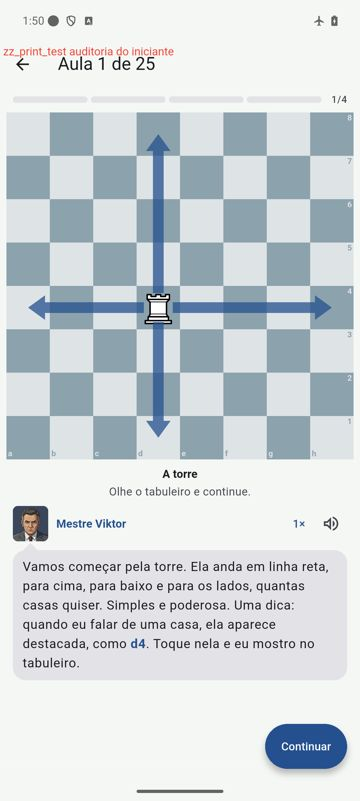
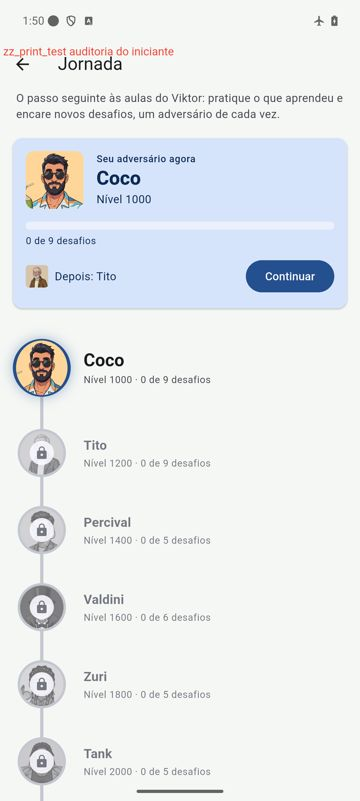
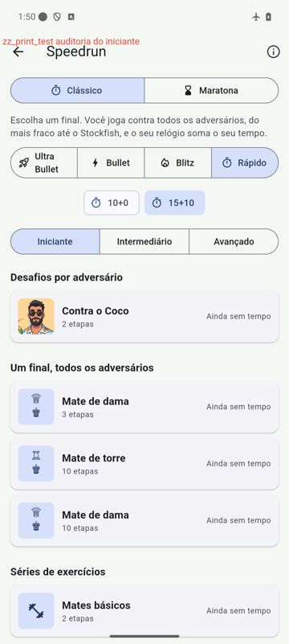
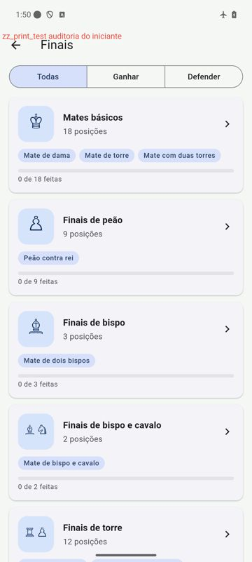

# Spike T43 · Experiência por nível

Feito em 2026-10-07, junto com a T42 e a T44, na branch `tarefa/T39-T40-voz-e-cegas`. As partes que já
viraram código nesta mesma entrega estão marcadas com ✅.

## 1 · Auditoria do fluxo do iniciante

Percurso no emulador, em português, com o perfil `beginner` escolhido no tour: tour, escola, primeira aula,
tela inicial, Jornada, speedrun e treino avulso.

| | | |
|---|---|---|
|  |  |  |
|  |  |  |
|  | | |

### O que funciona bem
- **Tour:** o Viktor reage ao "Iniciante" ("Começando? Que alegria…") e diz o que vem depois ("Você começa
  com as aulas do Viktor e depois a Jornada no 1000"). Com a T42, o passo seguinte já marca Aprender e
  Jornada.
- **Escola:** um botão óbvio ("Começar a primeira aula"), progresso "0 de 25" e a trilha com o resto
  bloqueado. Não há beco sem saída.
- **Aula:** pouco texto por passo, setas no tabuleiro e a dica "Olhe o tabuleiro e continue". Com a T44, as
  casas da fala ficam tocáveis, e a primeira fala ensina isso.
- **Jornada:** o cartão "Seu adversário agora" com "Continuar" e "Depois: Tito" deixa claro o próximo passo.

### Achados
| Tela | Achado | Tipo | Proposta |
|---|---|---|---|
| Tour, nível | "Abaixo de 1000", "1000 a 1299": números de rating sem explicação para quem nunca jogou | jargão | Trocar a linha de baixo por uma frase ("Estou aprendendo as regras", "Jogo com amigos") e deixar o número só nos níveis de cima |
| Speedrun | Três seletores empilhados (modo, ritmo e dificuldade) antes de qualquer final; "Bullet", "Blitz", "Ultra Bullet" e "15+10" sem explicação | escolhas demais, jargão | Para `beginner` e `casual`, ritmo recolhido numa linha só ("Ritmo: 15 min + 10 s ▾") e um ⓘ que explica "15+10" |
| Speedrun | "Ritmo" e "incremento" não aparecem explicados em lugar nenhum | jargão | Uma linha no ⓘ do speedrun: "15+10: 15 minutos para a partida e 10 segundos a mais a cada lance" |
| Treinar | "Ganhar" e "Defender" são claros, mas "Finais de bispo e cavalo" aparece para o iniciante no mesmo peso dos mates básicos | dificuldade que pula | Selo de dificuldade por categoria (como as categorias de speedrun) e os mates básicos primeiro |
| Aulas de finais | Títulos com nomes próprios ("Lucena", "Philidor") sem dizer o que é | jargão | O subtítulo já explica; manter, e o cartão "Continuar" só sugere essas aulas a partir do 1600 (spike da T42) |
| Escola → Jornada | A formatura (dois bispos) leva à Jornada no 1000, que só tem mates básicos: o aluno revê o que já fez | ritmo | Os desafios especiais do spike da T42 (às cegas, speedrun curto) dão novidade ao 1000 e ao 1200 |
| Balão | Falas da escola com 3 a 4 linhas; as das aulas de finais chegam a 8 | texto longo | Manter o limite de cerca de 300 caracteres por passo nas aulas novas (já é a regra da skill `aula-final`) |

### O que falta para chegar à Jornada sem travar
- **Notação:** a escola nunca ensina a ler "Tf7" ou "e4", mas a lista de lances, as falas e o modo às cegas
  usam notação o tempo todo. É o módulo de Notação proposto no spike da T42.
- **Relógio:** a Jornada e o speedrun usam relógio, e a escola nunca joga com ele. Proposta: o último passo
  da formatura é jogado com um relógio generoso (15+10), com o Viktor explicando o "+10".

## 2 · Speedruns por categoria ✅

Feito no código: campo `category` no `speedruns.json`, `SpeedrunCategory` no domínio e abas Iniciante,
Intermediário e Avançado na lista. A lista abre na aba do nível: `beginner` e `casual` em Iniciante,
`intermediate` e `advanced` em Intermediário, `expert` e `master` em Avançado. As três abas ficam sempre
visíveis, e a Maratona usa as mesmas abas.

| Categoria | Speedruns | Por quê |
|---|---|---|
| Iniciante | `ending.queen`, `ending.rook` | Os mates que a escola ensina |
| Intermediário | `ending.twoBishops`, `ending.pawn`, `ending.queenVsPawn`, `ending.rookVsPawn` | Pedem técnica (oposição, regra do quadrado, aproximação do rei) |
| Avançado | `ending.knightBishop`, `ending.queenVsRook`, `ending.rookPawnVsRook` | Teoria pesada: a manobra em W, Philidor, Lucena |

A validação jogando contra o Maia baixo e alto não foi feita nesta entrega. A tabela segue a ordem da escola
e das aulas de finais, e pode mudar no `speedruns.json` sem mexer em código.

**Maratona e Ultra Bullet para iniciantes:** ficam visíveis (nada escondido), mas a lista abre no ritmo do
nível (15+10 para o iniciante) e na aba Iniciante. O spike da T42 propõe apresentar a Maratona dentro da
Jornada, numa versão curta de 3 etapas.

## 3 · Menu com todos os modos ✅

Comparação:

| | Seção recolhida "Outros modos" | Tela "Todos os modos" |
|---|---|---|
| Toques até um modo escondido | 2 (abrir a seção e tocar) | 2 (botão no alto e tocar) |
| Clareza | Boa para 1 ou 2 caminhos; some se nada estiver escondido | Mostra o app inteiro, agrupado, inclusive o que não é "caminho" (estrelas, às cegas, conquistas) |

**Recomendação, já aplicada:** as duas. "Outros modos" fica na tela inicial para os caminhos escondidos, e
"Todos os modos" (botão no alto) é o mapa do app, agrupado em Aprender, Jogar, Ferramentas e Progresso.
Falta, para uma próxima tarefa, abrir "Todos os modos" já no grupo do nível.

## 4 · Finais básicos no formato das aulas de finais

Um módulo novo, "Finais básicos", feito com a skill `aula-final`, que aprofunda o que a escola apresenta sem
repetir.

| Aula | Objetivo | Posições principais | Passos | Exercícios |
|---|---|---|---|---|
| **Mate de dama em poucos lances** | Mate em até 10 lances de qualquer posição: a dama "em L" de cavalo, empurrando o rei; evitar o afogamento | Rei no centro; rei na borda; a armadilha do afogamento no canto | 6 | 4, contra o relógio |
| **Mate de torre: a caixa** | Encolher a caixa da torre e usar a oposição dos reis | Caixa grande; o rei de apoio em oposição; o lance de espera | 7 | 4 |
| **Dois bispos** | Os bispos lado a lado como parede, o rei empurrando até o canto (qualquer canto) | Parede de bispos no centro; o rei inimigo na borda; o mate no canto | 7 | 3 |
| **Rei e peão contra rei** | Oposição, casas-chave básicas, a regra do quadrado e o peão de torre empatado | Peão na 5ª com oposição; regra do quadrado; rei na frente do peão de torre | 8 | 5 |
| **Dama contra peão na sétima** | Ganhar contra o peão central; saber quando o peão de bispo ou de torre empata | Peão em d2; peão em c2 com o truque do afogamento; peão em a2 | 7 | 4 |
| **Torre contra peão** | Cortar o rei, contar os tempos, quando a torre ganha e quando é empate | Rei atrás do peão; o corte na fileira; corrida de tempos | 7 | 4 |

As posições saem do catálogo (`basic.*`, `pawn.pawnVsKing.*`, `queen.queenVsPawn.*`,
`rookPawn.rookVsPawn.*`), que já tem as de partida e os speedruns.

## 5 · Correções feitas no caminho
- A primeira aula da escola e a primeira aula de finais explicam que as casas destacadas na fala são
  tocáveis (T44).
- Speedrun: as abas de dificuldade (seção 2).

## Próximas tarefas
Escritas em `docs/tasks/`, junto com as do spike da T42 (`docs/spikes/T42-jornada-introdutoria.md`):

- **T45 · Notação nas aulas** (spike T42).
- **T46 · Desafios de modalidade na Jornada** (spike T42).
- **T47 · Animações do fluxo do iniciante** (spike T42).
- **T48 · Finais básicos, lote 1:** mate de dama, mate de torre e dois bispos.
- **T49 · Finais básicos, lote 2:** rei e peão, dama contra peão e torre contra peão.
- **T50 · Correções do iniciante:** os achados da auditoria (nível sem números, ritmo recolhido no speedrun,
  ⓘ do "15+10", relógio na formatura, selo de dificuldade no Treinar, "Todos os modos" aberto no grupo do
  nível).
